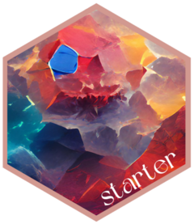

<!-- README.md is generated from README.Rmd. Please edit that file -->

# starter <a href="https://www.danieldsjoberg.com/starter/"></a>

<!-- badges: start -->

[](https://github.com/ddsjoberg/starter/actions)
[](https://app.codecov.io/gh/ddsjoberg/starter?branch=main)
[](https://CRAN.R-project.org/package=starter)
<!-- badges: end -->

The **starter** package provides a toolkit for starting new projects.

## Installation

Install {starter} from CRAN with:

``` r
install.packages("starter")
```

Install the development version of {starter} from
[GitHub](https://github.com/ddsjoberg/starter) with:

``` r
# install.packages('devtools')
devtools::install_github("ddsjoberg/starter")
```

## Example

``` r
library(starter)

create_project(
  path = fs::path(tempdir(), "My Project Folder"),
  open = FALSE # don't open project in new RStudio session
)
#> ✔ Using "Default Project Template" template
#> ✔ Writing folder '/var/folders/6f/gdjf_vxj2wl3jhmxdkd1hd_w0000gn/T/RtmpTUywzl/My Project Folder'
#> ✔ Writing files "README.md", ".gitignore", "My Project Folder.Rproj", and ".Rprofile"
#> ✔ Initialising Git repo
#> ✔ Initialising renv project
#> - Lockfile written to "/private/var/folders/6f/gdjf_vxj2wl3jhmxdkd1hd_w0000gn/T/RtmpTUywzl/My Project Folder/renv.lock".
#> - renv infrastructure has been generated for project "/private/var/folders/6f/gdjf_vxj2wl3jhmxdkd1hd_w0000gn/T/RtmpTUywzl/My Project Folder".
```

## Example Templates

Check out examples of starter templates currently being used.

``` r
devtools::install_github("ddsjoberg/bstfun")
create_project(
  path = fs::path(tempdir(), "My Project Folder"),
  template = bstfun::project_templates[["hot"]]
)

create_project(
  path = fs::path(tempdir(), "My Project Folder"),
  template = bstfun::project_templates[["default"]]
)
```

## Code of Conduct

Please note that the starter project is released with a [Contributor
Code of
Conduct](https://contributor-covenant.org/version/2/0/CODE_OF_CONDUCT.html).
By contributing to this project, you agree to abide by its terms.
